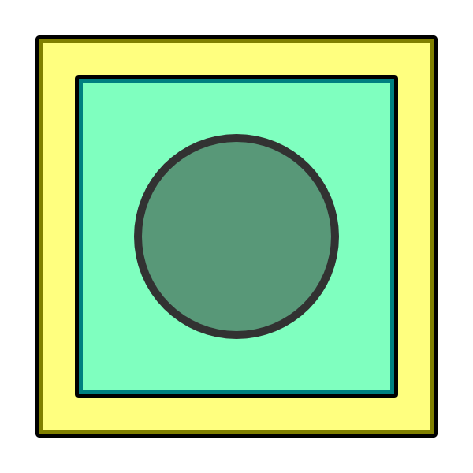

# Cairoo

#### Cairoo is an easy to use wrapper for cairocffi. Making drawing coloured shapes, with opacity and stokes to png a breeze.

### Install 
Its easy.
```
pip install cairoo
```

### Usage
Even easier.

```python
#import
from cairoo import Cairoo

#set shape and background colour
cai = Cairoo(w=600,h=600,bg_colour=(255,255,255))

#make polygon
poly = [[50,50],[550,50],[550,550],[50,550]]

#draw polygon
cai.draw_polygon(poly,colour=(255,255,0),line_colour=(0,0,0),line_width=10,fill_trans=0.5)

#make another polygon
poly = [[100,100],[500,100],[500,500],[100,500]]

#draw polygon
cai.draw_polygon(poly,colour=(0,255,255),line_colour=(0,0,0),line_width=10,fill_trans=0.5)

#get point for circle
point = [300,300]

#draw polygon
cai.draw_circle(point, width=250, colour=(50,50,50),line_colour=(50,50,50),line_width=10,fill_trans=0.5)

# show image in jupyter (get pil image)
cai.get_pil()

# get numpy array of image 
cai.get_numpy()

#save image
cai.save_image("path/to/save/image.png")

```



### More info

See the doc strings for detailed information.

### Contact
lewis.morris@gmail.com

### See it in the wild.

[thecomputermade.me](https://www.thecomputermade.me) 

